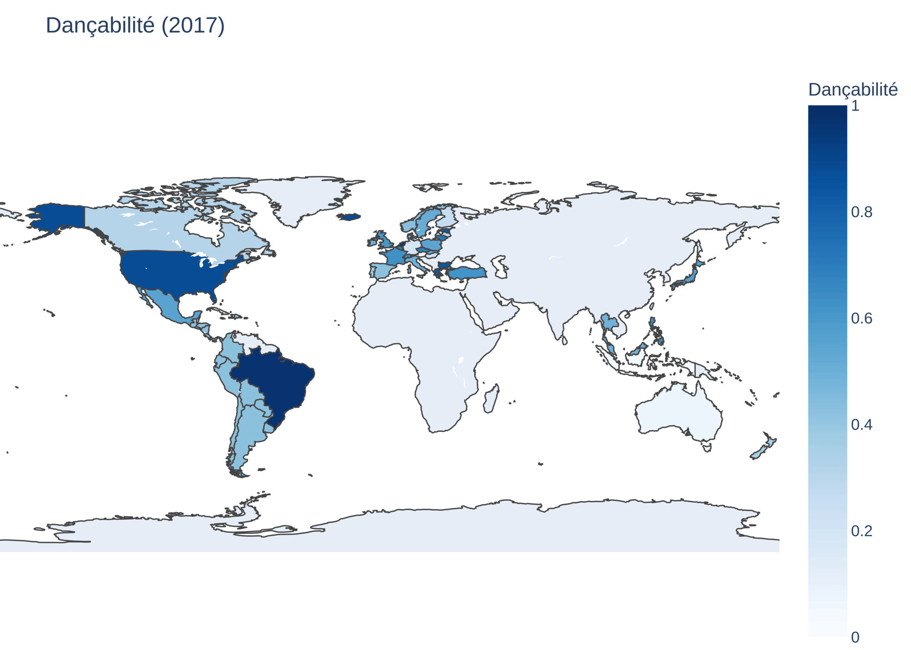
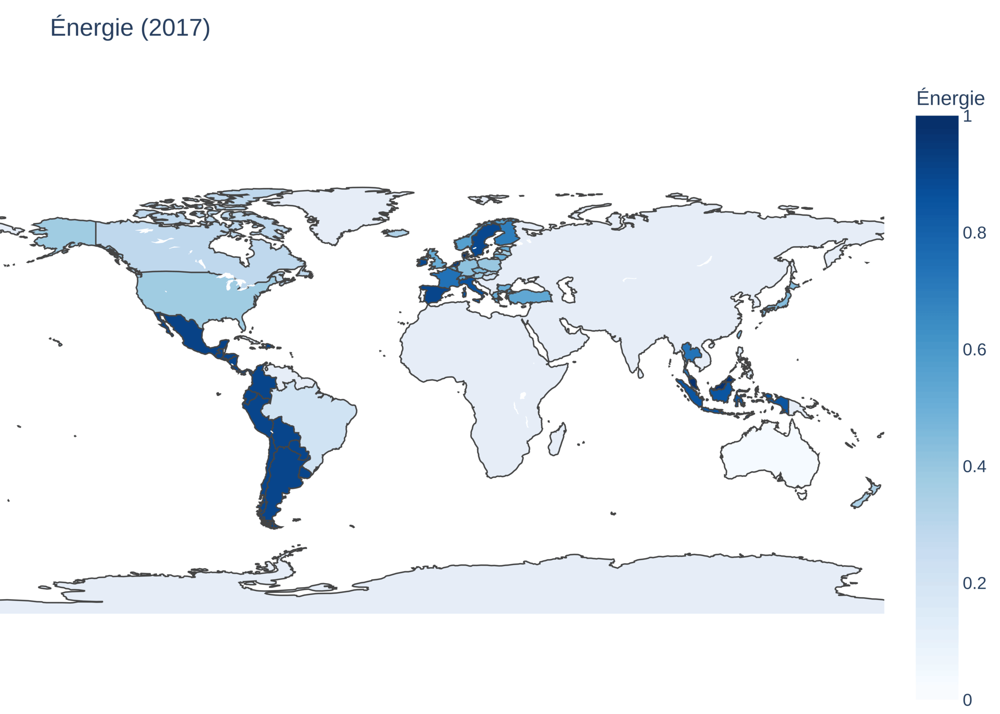
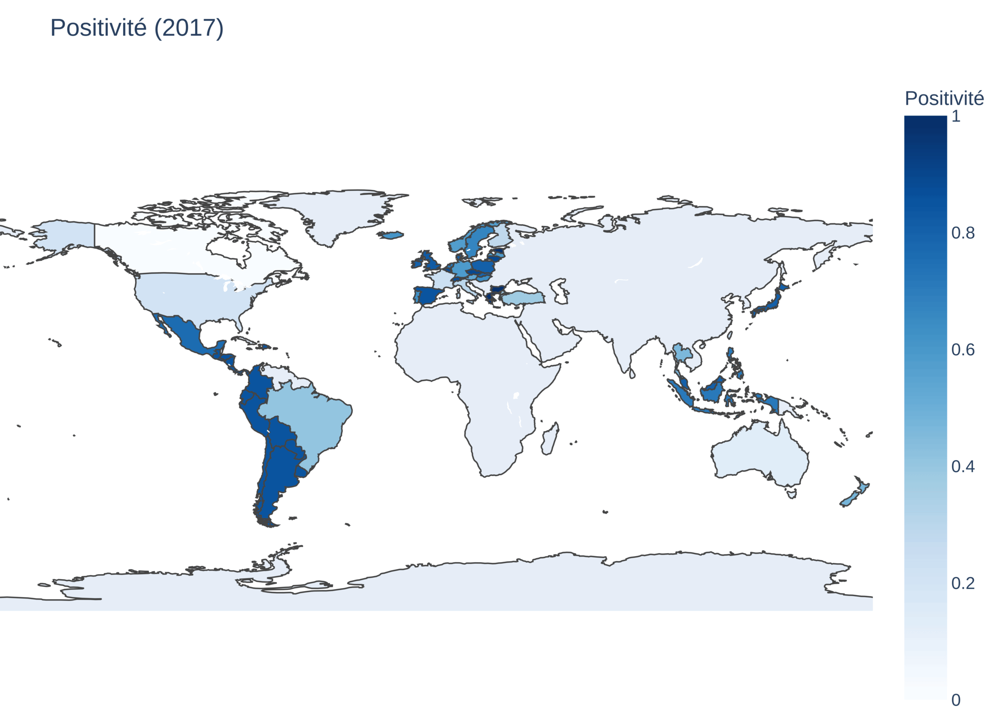
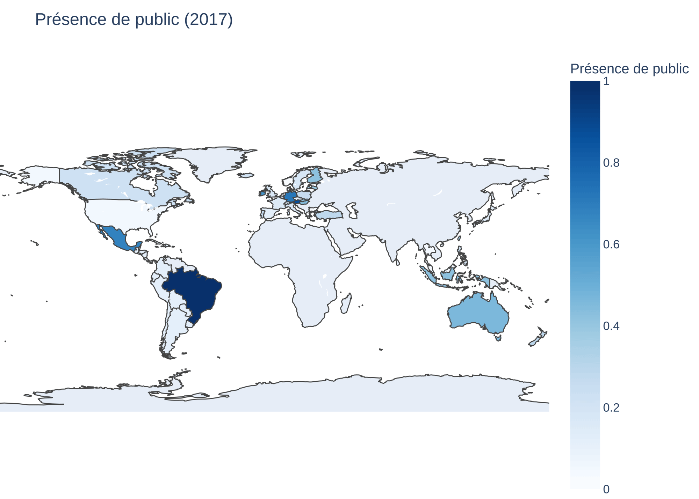

# [BigData] Study of popular songs around the world

<!--  -->

This project is part of the BigData (CY07) course at ENSTA Paris. It consists in working with a large amount of data and the tools seen in the course (e.g. `Spark`) to answer interesting questions in terms of business. We have chosen to study musical popularity over the years and around the world. 

## Context
<!-- Context: what is the domain, what questions you are trying to answer. -->

Studying popularity of musics can be useful in terms of: 
- **Geopolitics**: popularity of a song can be coupled with a socio-political view of the region (e.g. can country be clustered by music or is music universal?)
- **Music industry**: discover the best criteria that make a music popular in order to create the next hits 

For both points of view, we created questions and tried to answer them: 
- How do musical trends vary over the years?
- Can countries be clustered by similar music tastes?
- Which musical characteristics (tempo, energy, etc.) give the best chances of success?
  
## Dataset
<!-- Dataset: source, size, format, structure, what it looks like -->

The dataset used for these studies is the Spotify Charts (All Audio Data) that is characterized by: 


- **Source** : Spotify Charts (All Audio Data) available at [`kaggle.com`](https://www.kaggle.com/datasets/sunnykakar/spotify-charts-all-audio-data)
  - top 200 musics by region between 2017 and 2021 (given by Spotify)
  - enriched with metadata (from Spotify API)
- **Format** : `CSV`
- **Size** : ~27 Go
- **Schema**: The dataset contains 29 columns that can be divided into three groups:
  - characteristics to identify a song (eg. *title*, *artist*)
  - characteristics to measure its impact on a region (eg. *streams*, *region*)
  - characteristics to describe a song (eg. audio features as *af_energy*)


  <details>

  <summary>See full schema</summary>

  ```
  root
  |-- id: long (nullable = true)
  |-- title: string (nullable = true)
  |-- rank: long (nullable = true)
  |-- date: date (nullable = true)
  |-- artist: string (nullable = true)
  |-- url: string (nullable = true)
  |-- region: string (nullable = true)
  |-- chart: string (nullable = true)
  |-- trend: string (nullable = true)
  |-- streams: long (nullable = true)
  |-- track_id: string (nullable = true)
  |-- album: string (nullable = true)
  |-- popularity: double (nullable = true)
  |-- duration_ms: double (nullable = true)
  |-- explicit: boolean (nullable = true)
  |-- release_date: date (nullable = true)
  |-- available_markets: string (nullable = true)
  |-- af_danceability: double (nullable = true) 	
  |-- af_energy: double (nullable = true) 	
  |-- af_key: double (nullable = true)			
  |-- af_loudness: double (nullable = true)
  |-- af_mode: boolean (nullable = true)		
  |-- af_speechiness: double (nullable = true)
  |-- af_acousticness: double (nullable = true)
  |-- af_instrumentalness: double (nullable = true)
  |-- af_liveness: double (nullable = true)
  |-- af_valence: double (nullable = true)			
  |-- af_tempo: double (nullable = true)				
  |-- af_time_signature: double (nullable = true)
  ```

  </details>
  
An extract of the dataset is presented in the table below (some columns are omitted for better readability): 

")


## Methodology:

<!-- pipeline description, tools used, architecture choices. -->

This project is split into two different parts:
- a _data processing_ part, that ingest, clean and do the computations to answer the questions;
- a _data visualization_ part, that produces visual reports based on the computation outputted by the previous part.

These parts are respectively nicknamed _back_ and _font_ (like the back-end and front-end of a Web application).

### Data processing ([`back`](./bigdata-back/))

This part is written in Java, using the Spark framework. It handles:
- the conversion of the dataset from `CSV` to `Parquet`;
- the various computations needed to answer the questions.

### Data visualization ([`front`](./bigdata-front/))

This part is written in Python (because of its rich ecosystem of visualization modules), and produces maps and charts to create a visual representation of the answers.

## Results

<!-- key findings, presented with tables or charts. -->

### Musical Trends
> How do musical trends vary over the years? 

We decided to highlight the variation of musical trends over the years through world-maps colored in shades of blue (all data have been normalized, hence colors are relative).

TODO analyze result 

<figure>
    
    
    <figcaption>Correlation between danceability and energy in musical trends</figcaption>
</figure>

We also figured out that musical trends tend to be impacted by external causes. As we could see in the following images, musics' positiveness increases in 2019-2020 meanwhile liveness drops due to Covid-19.

<figure>
    
     
    <figcaption>Impact of the Covid-19 on liveness and valence of song</figcaption>
</figure>


### Countries clustering
> Can countries be clustered by similar music tastes?

TODO analyze result + show image


### Musical success characteristics
> Which musical characteristics (tempo, energy, etc.) give the best chances of success?

TODO analyze result 


## How to run

<!-- step-by-step instructions to reproduce your pipeline. -->

### Dataset retrieving and cleaning

First, get the dataset from Kaggle [here](https://www.kaggle.com/datasets/sunnykakar/spotify-charts-all-audio-data) and put it in a folder in [`data/`](./data/) (for instance, `data/input/`).
After unzipping it, we need to fix the first line (CSV header) because the first field is missing:

```bash
cd data/input
unzip archive.zip
sed -i '1 s/^,title,rank,date/id,title,rank,date/' merged_data.csv
```

TODO COUNTRY CSV

### Backend building

Then, build the Java backend using Maven: 

```bash
cd bigdata-back
mvn package
```

This should create a `JAR` file under `target/bigdata-back-1.0-SNAPSHOT.jar`.

### Convert dataset

We need to convert the dataset from `CSV` to `Parquet`, using the previously built `JAR`:

```bash
cd bigdata-back
# will create a parquet file in ../data/input
java -cp target/bigdata-back-1.0-SNAPSHOT.jar fr.ensta.bigdata.utils.CsvToParquet ../data/input/merged_data.csv ../data/input/all-data.parquet
```

### Perform computations

Finally, we just need to launch the main class to perform the computations needed to answer the questions.

```bash
java -cp target/bigdata-back-1.0-SNAPSHOT.jar fr.ensta.bigdata.Main ../data/input/all-data.parquet ../data/generated
```

### Generate visualization

TODO RUN PYTHON

## Dependencies

<!-- list of all required software and libraries with versions -->^